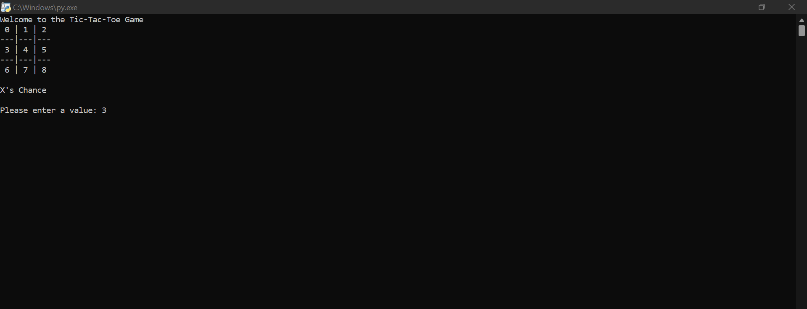
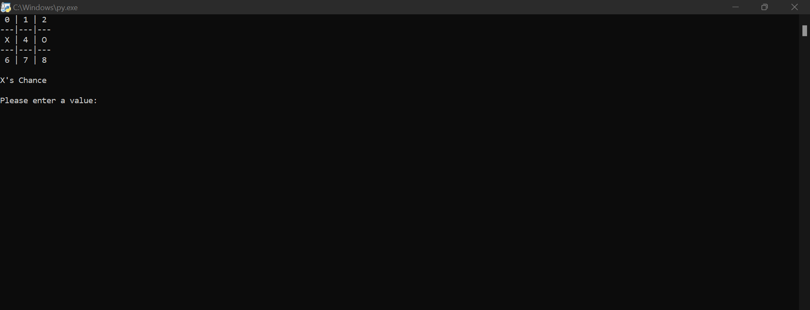

# Tic Tac Toe
Tic tac toe is a game in which two players alternately put X's and O's in compartments of a figure formed by two vertical lines crossing two horizontal lines and each tries to get a row of three Xs or three Os before the opponent does. 
First the game will start with this interface

Now firstly X enter the value then 0 enter the value. Let suppose X enter 3 then position 3 is marked as X and now it's a chance of 0.

Let suppose 0 enter 5 then position 5 is marked as 0 and now it's a chance of X.

